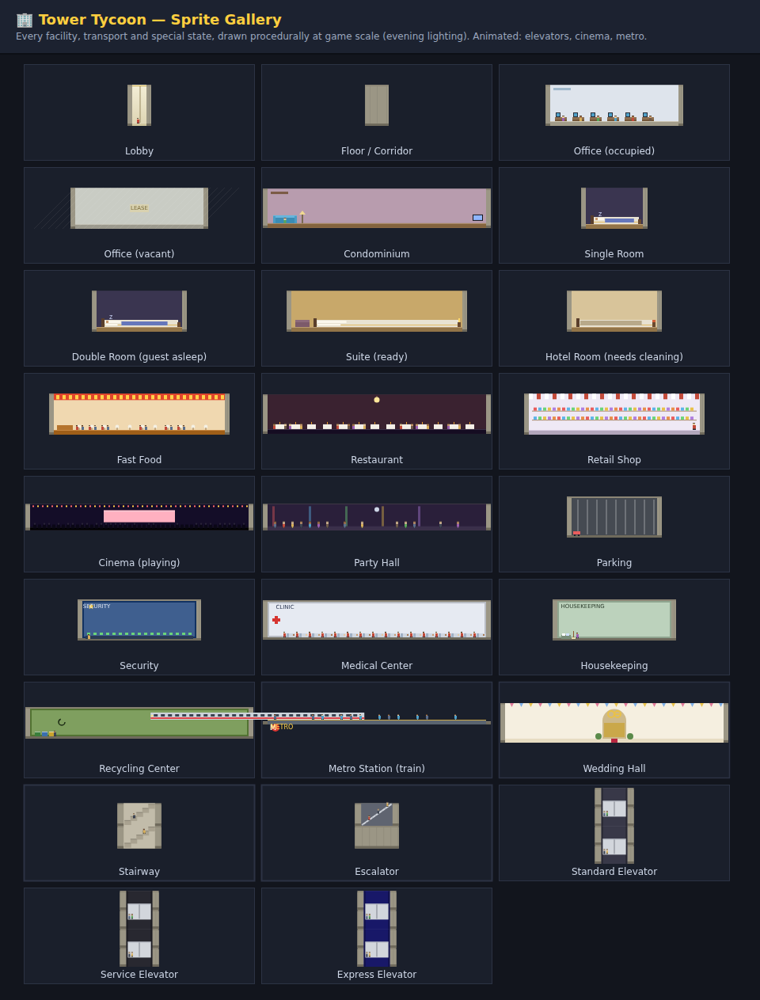
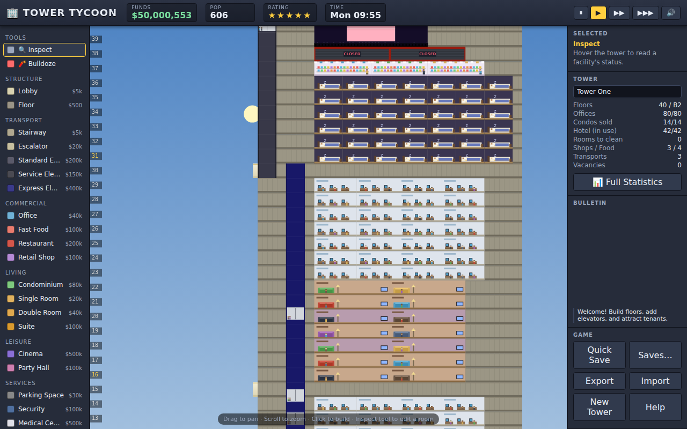
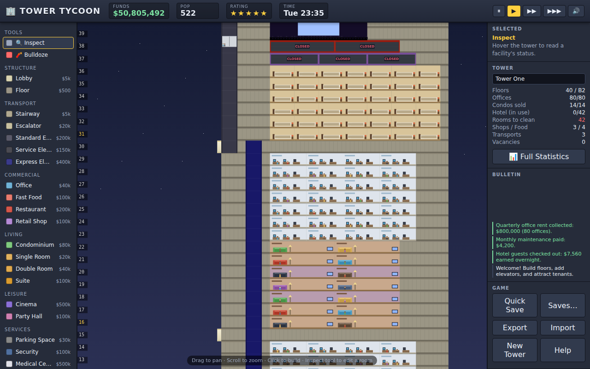

# 🏢 Tower Tycoon — a browser SimTower clone

A from-scratch, browser-native homage to the classic **SimTower** (1994). Build a
high-rise floor by floor, wire it with elevators, attract tenants, keep them
happy, and climb the star ratings all the way to a coveted **TOWER**.

Written in **TypeScript**, rendered on an **HTML5 Canvas**, with a procedural
**WebAudio** soundtrack that changes depending on which part of the tower you're
looking at. No game engine, no external art assets — every sprite is drawn in
code.



## Play

```bash
npm install
npm run dev      # open the printed localhost URL
```

Other scripts:

```bash
npm run build        # production build to dist/
npm run preview      # serve the production build
npm test             # run the Vitest suite
npm run typecheck    # tsc --noEmit
npm run lint         # eslint
npm run screenshots  # build + headless-capture screenshots into docs/screenshots
```

## How to play

- **Build floors first.** Lay `Floor` tiles, then place rooms on top of them.
  The ground floor and every 15th floor want a `Lobby`.
- **Move people.** Every floor needs an `Elevator` or `Stairs` chain back to the
  ground lobby — unreachable tenants get unhappy and leave.
- **Make money.** Offices pay quarterly rent, condos sell once for a lump sum,
  hotels earn nightly (and must be cleaned by `Housekeeping`), and shops,
  restaurants and cinemas earn from foot traffic.
- **Grow your rating.** ⭐ thresholds: 2★ at 300 population, 3★ at 1,000 (needs
  Security), 4★ at 5,000 (needs a Medical Center), 5★ at 10,000.
- **Win.** At 5★ with a Metro Station, build the `Wedding Hall` on floor 100 and
  pass the VIP inspection to become a **TOWER**.

### Controls

| Action | How |
| --- | --- |
| Pan | Drag with the Inspect tool, middle/right mouse, or hold Space |
| Zoom | Mouse wheel |
| Build a room | Pick it from the left palette, click on a floor |
| Build/paint floors | Pick `Floor`/`Lobby`, click-drag |
| Build an elevator/stairs | Pick it, drag vertically to set the span |
| Edit a facility | Inspect tool, click a room or shaft → edit panel |
| Bulldoze | Bulldoze tool, click (or drag) |
| Game speed | Top-right buttons, or number keys `0`–`3` |

## Features

- **Facilities:** lobby, floors, offices, condominiums, three hotel room grades,
  fast food, restaurants, shops, cinema, party hall, parking, security, medical,
  housekeeping, recycling, metro station and the wedding hall.
- **Transport:** stairs, escalators, and **standard / service / express**
  elevators — each with adjustable car counts and served-floor ranges, edited
  in-game just like the original.
- **Living tower:** people walk the lobbies, elevator cars carry passengers up
  and down, window lights switch on and off, the cinema screen plays, and the
  metro train pulls in and departs. All of it runs off a single global game
  clock — no per-room timers.
- **Economy & time:** weekday/weekend rhythms, morning/lunch/evening rushes,
  quarterly rent, monthly maintenance, nightly hotel revenue, and a daily
  housekeeping cycle (rooms get dirty after checkout and need cleaning).
- **Star ratings** with population thresholds and facility gates, ending in the
  VIP TOWER evaluation.
- **Location-aware soundtrack:** a procedural WebAudio synth crossfades between
  musical "scenes" (lobby muzak, office hum, hotel calm, food-court bustle,
  cinema score, subway rumble…) based on what the camera is centered on, plus
  build/sell/promotion jingles.
- **Save anywhere:** autosave to `localStorage`, plus JSON export/import.

## Architecture

```
src/
  engine/      # pure simulation — no DOM
    types.ts        shared types
    facilities.ts   facility catalog, costs, star thresholds, grid constants
    Clock.ts        game time (days, weekdays, day phases, quarters)
    rng.ts          deterministic PRNG (mulberry32)
    Tower.ts        spatial model: two-layer grid, placement rules, reachability
    Simulation.ts   economy, population, satisfaction, ratings, events, save
  render/      # canvas presentation
    Renderer.ts     camera, culling, cached structural runs, live animation
    sprites.ts      procedural per-facility drawing
  ui/UI.ts     # palette, status bar, editor panel, modals, toasts
  audio/Audio.ts  # location-based procedural soundtrack + SFX
  storage/SaveGame.ts  # localStorage + JSON import/export
  main.ts      # GameApp: input, game loop, glue
  gallery.ts   # standalone sprite-catalog page (docs/screenshots)
  tests/       # Vitest unit tests for the engine
```

The **engine** is deliberately DOM-free and deterministic so it can be unit
tested in isolation (`npm test`). The **renderer** never mutates the simulation;
it only reads state and draws. Performance comes from bucketing units by floor,
merging contiguous floor/lobby tiles into cached "runs", culling off-screen
geometry, and throttling DOM/audio updates while rendering stays at 60 fps.

## Screenshots

| Day | Night |
| --- | --- |
|  |  |

## Tests

33 Vitest unit tests cover placement rules, transport reachability, the economy
(rent, condo sales, maintenance), star promotion and its facility gates, the
hotel housekeeping cycle, elevator editing, save/load round-trips, and the
clock. Run with `npm test`.

---

Built fresh as a clean-room clone — none of the original game's code or assets
are used.
